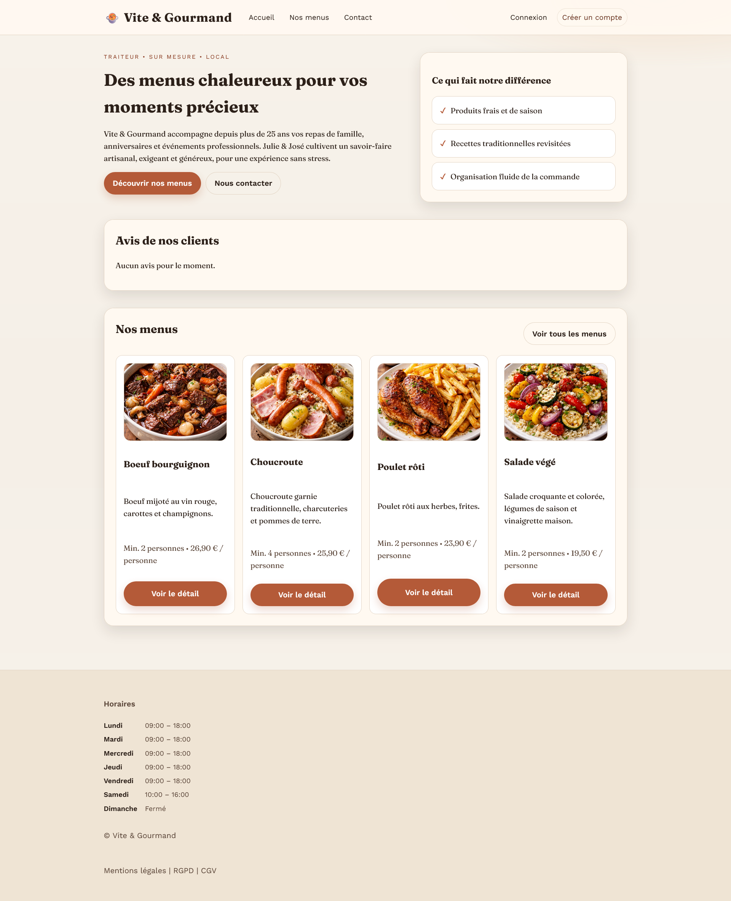
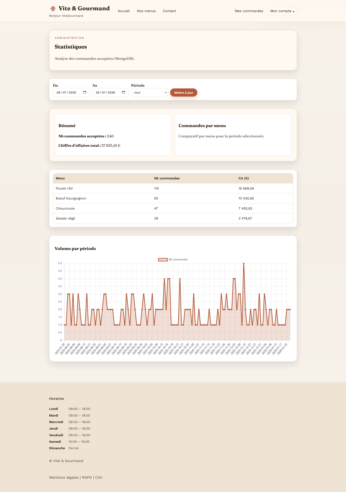

# 🍲 Vite & Gourmand

Vite & Gourmand est une application web de gestion de commandes pour un service traiteur.




---

## 🎯 Fonctionnalités principales

### Front (utilisateur)
- Inscription, connexion, réinitialisation du mot de passe (email)
- Consultation des menus et plats
- Passage de commandes en ligne
- Gestion du profil utilisateur
- Dépôt d’avis clients
- Formulaire de contact

### Back-office (admin et employé)
- Gestion des menus (CRUD, activation/désactivation, images)
- Gestion des plats et allergènes
- Association menus ↔ plats ↔ allergènes
- Gestion des commandes (statuts, historique)
- Gestion des avis
- Gestion des horaires
- Gestion des employés (ADMIN)
- Statistiques de ventes (ADMIN)

---

## 👥 Rôles utilisateurs

- **USER** : client final
- **EMPLOYE** : gestion des commandes, menus, avis, horaires
- **ADMIN** : gestion globale + statistiques

Les accès sont contrôlés côté serveur selon le rôle.

---

## 🏗️ Structure du projet

- `public/` : index, style css, SEO/crawl, images
- `src/config/` : Fichiers de configuration (env et db)
- `src/controller/` : Contrôleurs (logique métier)
- `src/model/` : Modèles (accès aux données et logique db)
- `src/service/` : Services applicatif (mail)
- `src/security/` : auth + CSRF
- `src/helper/` : fonctions utilitaires (format, erreurs)
- `views/` : Vues (pages affichées)
- `db/` : Scripts SQL de démonstration
- `sql/` : Scripts SQL de référence (lecture / documentation)

---

## 📧 Emails

Envoi d’emails réels via SMTP :
- Réinitialisation du mot de passe
- Notifications liées aux commandes

Configuration via `.env` avec `MAIL_FROM_EMAIL`, `MAIL_FROM_NAME` et `MAILER_DSN` (ex. SMTP Brevo comme dans `.env.example`).

---

## 💾 Installation (local)

### Prérequis
- Docker
- Docker Compose
- PHP 8.x
- Extension PHP MongoDB
- Composer

### 1. Cloner le dépôt

```bash
git clone https://github.com/Camprch/vite-gourmand.git
cd vite-gourmand
```

### 2. Configuration

Créer le fichier `.env` à partir de l’exemple :
```bash
cp .env.example .env
```

### 3. (Optionnel) Reset complet des bases

⚠️ Cette commande supprime toutes les données (MariaDB + MongoDB) et rejoue les seeds.
```bash
docker-compose down -v
docker-compose up -d
```

### 4. Démarrer les bases (MariaDB + MongoDB)

Cette commande démarre **les deux bases** et initialise MariaDB (schéma + données de démonstration).  
MongoDB est démarrée vide (prête pour les stats).

```bash
docker-compose up -d
```

### 5. Générer des stats de démo (MongoDB)

Ce script remplit MongoDB avec des données statistiques réalistes :

```bash
./db/seed-mongo.sh
```

Options :
```bash
COUNT=400 DAYS=240 ./db/seed-mongo.sh
```

Le script utilise les variables `.env` suivantes :
- `MONGO_INITDB_ROOT_USERNAME`
- `MONGO_INITDB_ROOT_PASSWORD`
- `MONGO_DB`

### 6. Lancer l'application

```bash
php -S localhost:8000 -t public
```

Accès via : [http://localhost:8000](http://localhost:8000)

---

## 🗄️ Bases de données (résumé)

- **MariaDB (SQL)** : données transactionnelles (users, menus, commandes, etc.)
  - Init auto via Docker : `db/01_schema.sql` + `db/02_seed.sql`
- **MongoDB (NoSQL)** : statistiques
  - Remplissage via `./db/seed-mongo.sh`

### Scripts SQL (MariaDB)

Deux fichiers de schéma coexistent volontairement :
- `db/01_schema.sql` : utilisé par **Docker/MariaDB** pour l’initialisation automatique en local.
- `sql/schema.sql` : **référence de schéma** pour déploiement / prod / usage manuel.

Convention : modifier d’abord `sql/schema.sql`, puis reporter
dans `db/01_schema.sql` si besoin.

---

## 🔐 Identifiants de test

- Compte ADMIN :  
Email : admin@vitegourmand.local   
Mot de passe : Admin12345!   

- Compte EMPLOYÉ :  
Email : employe@vitegourmand.local   
Mot de passe : Employe123!  

- Compte Utilisateur :  
Email : user@vitegourmand.local  
Mot de passe : Utilisateur123!  
